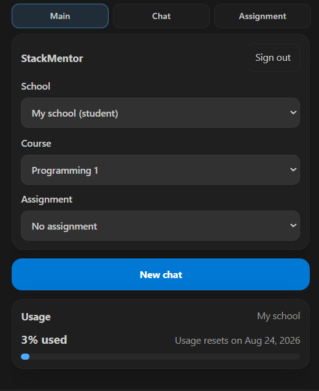
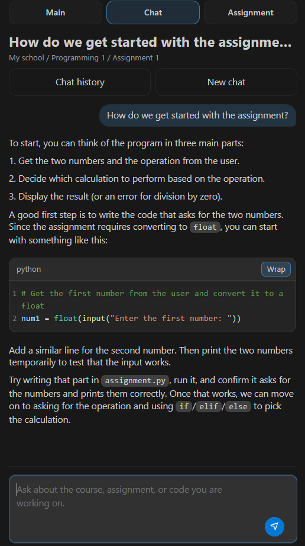
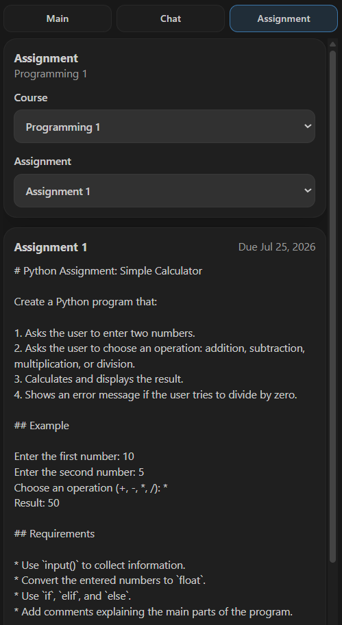

# StackMentor VS Code Extension

StackMentor is an open-source VS Code client for the privately operated StackMentor learning service. It lets invited students ask questions about their course, assignment, and code without leaving the editor.

The extension is not a standalone offline or personal-use tool. You need an account and access to the StackMentor-operated backend. Personal backend hosting is not supported.

## Features

- Sign in with a StackMentor account from the sidebar
- Select a school, course, and optional assignment before starting a chat
- Send questions and receive mentor replies in the sidebar
- View assignment details and current-period usage

## Screenshots

### Main view

### Chat view

### Assignment view

## Requirements

- VS Code 1.125.0 or newer. The extension manifest currently declares compatibility with `^1.125.0`.
- A StackMentor account with student access to at least one school and course.
- Network access to an authorized StackMentor backend.
- An active course and an active paid usage period.

## Setup for students

1. Install the extension from the [VS Code Marketplace](https://marketplace.visualstudio.com/items?itemName=StackMentor.stackmentor).
2. Open the StackMentor activity bar item.
3. Sign in with the account provided by your school or deployment operator.
4. Select a school and course, then start a chat.

## Commands

- `StackMentor: Open`
- `StackMentor: Refresh`
- `StackMentor: New Chat`
- `StackMentor: Sign Out`

## Settings

- `stackmentor.apiBaseUrl`: Base URL for the StackMentor-operated backend API.
- `stackmentor.frontendBaseUrl`: Base URL for StackMentor web pages used for sign-up and password reset.

The released extension connects to StackMentor's hosted services. StackMentor does not support operating a separate backend.

## Privacy and data handling

The extension sends mentor requests to the configured StackMentor backend. Depending on the request and workspace state, a request may include:

- The student's message, selected school/course/assignment, and conversation history
- The active file path, selected text, and nearby code around the selection
- Bounded content from visible text editors in the trusted workspace
- Workspace-relative paths for up to five opened text tabs, including tabs that are not visible
- Files explicitly mentioned in the student's message
- A bounded code range from an opened file when Scout requests additional context

The extension skips common sensitive paths and files, including `.env` files, credentials, secrets, private keys, and certificate files. When the VS Code workspace is untrusted, the extension does not collect or respond with project file context. A mentor job can request a bounded range only from one of the opened workspace tabs whose path was included with that request.

The backend stores account and chat data and may process mentor context using its configured model providers. The backend operator is responsible for access control, provider configuration, retention, and deletion.

## Legal information

- [Privacy Policy](https://stackmentor.dev/privacy)
- [Terms of Service](https://stackmentor.dev/terms)

## Support and security

Public GitHub Issues and pull requests are disabled. For general support, see
[SUPPORT.md](SUPPORT.md). Please do not include student code, chat history,
credentials, or other confidential data in repository content or support
requests.

Report security vulnerabilities privately according to the repository's [security policy](SECURITY.md).

## License

The extension is released under the [MIT License](LICENSE).
